# Office Task Management Web Application

A full-stack web application for managing tasks, projects, meetings, and organizational workflow with role-based access control for Admin, Manager, and Employee users.

---

## 👨‍💼 Admin Interface

### User Management

  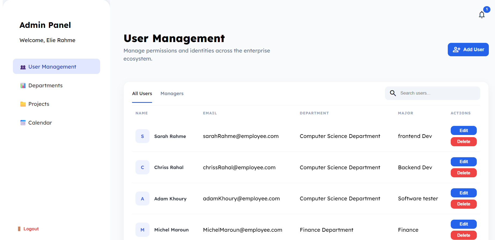

### Departments

  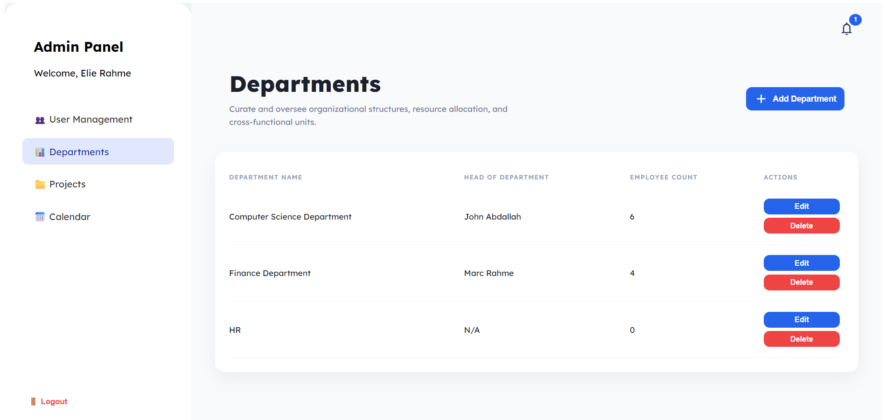

### Projects

  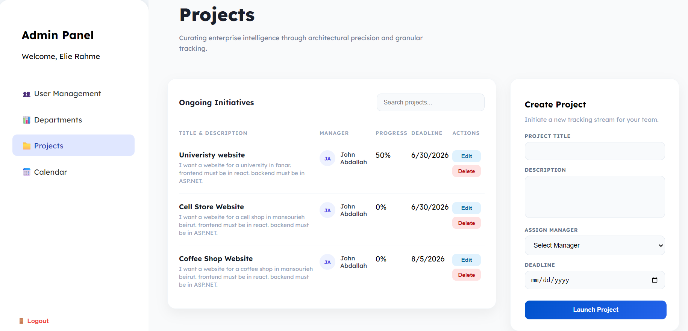

### Calendar

  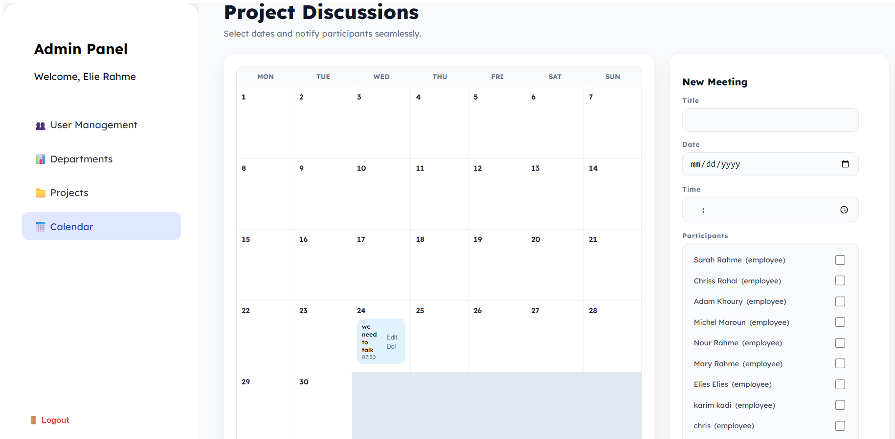

---

## 👨‍🏫 Manager Interface

### Employees

  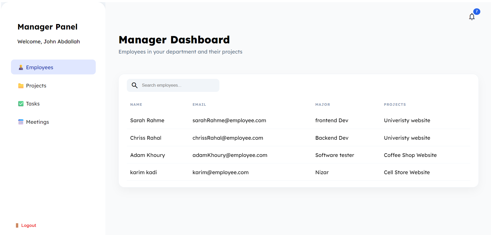

### Projects

  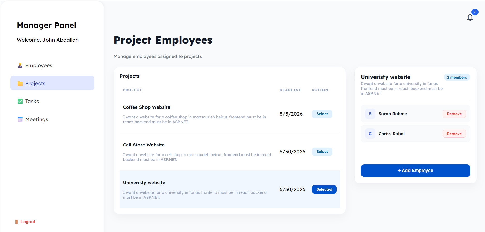

### Tasks

  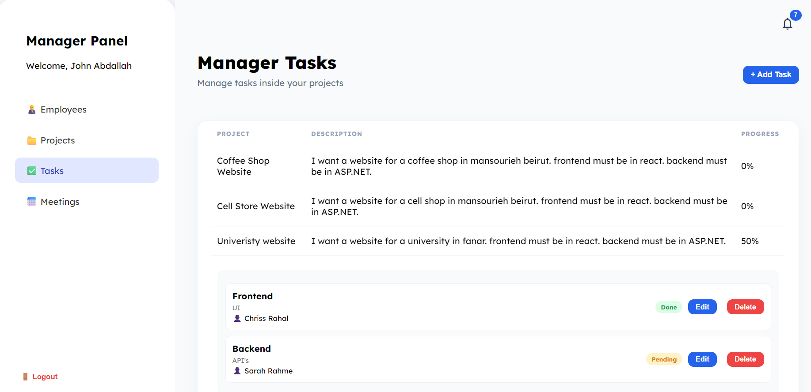

### Meetings

  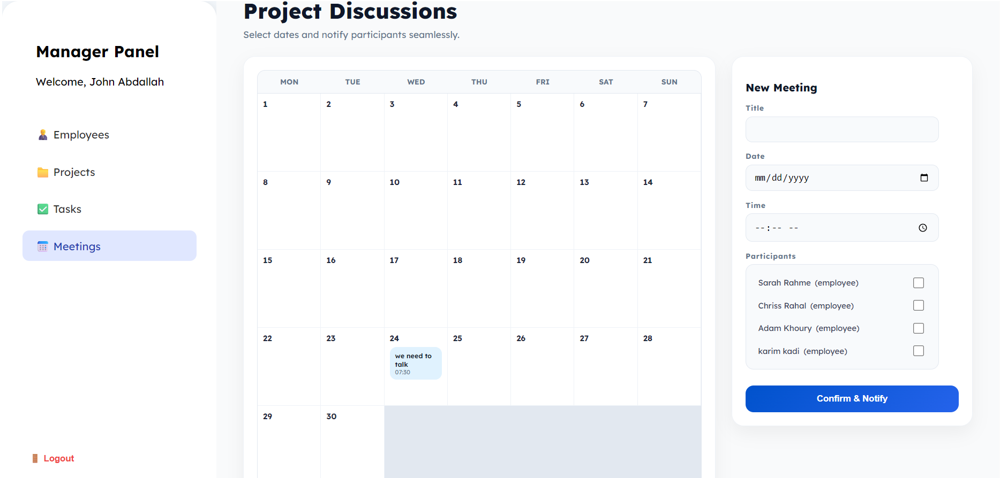

### Notifications

  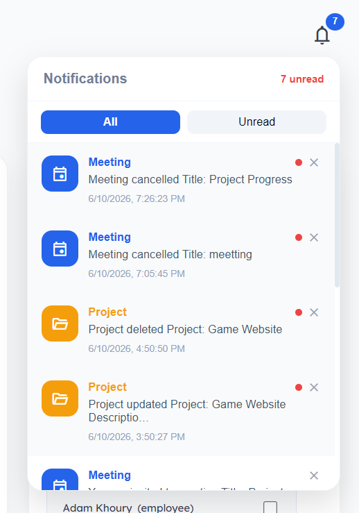

---

## 👨‍💻 Employee Interface

### Projects

  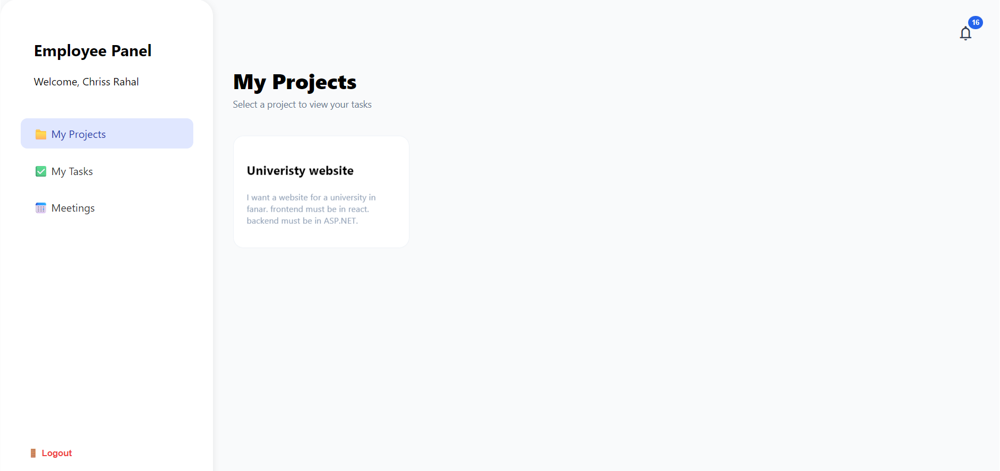

### Project Details

  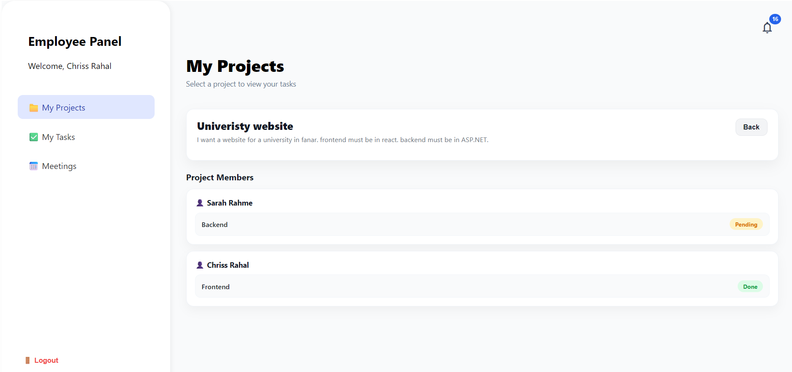

### Tasks

  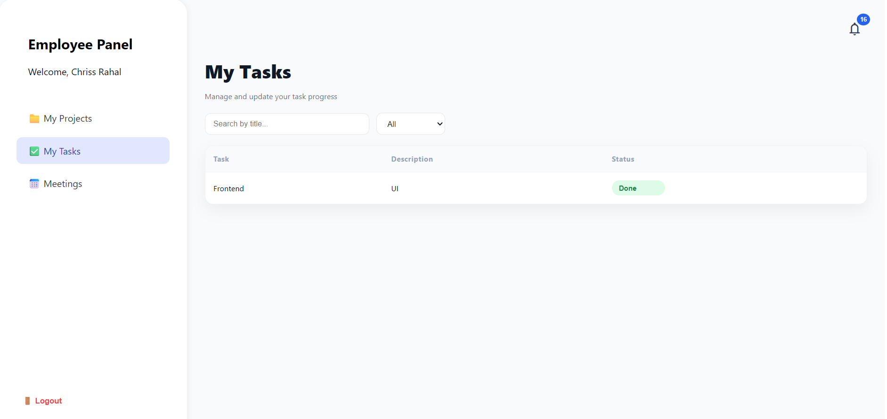

### Meetings

  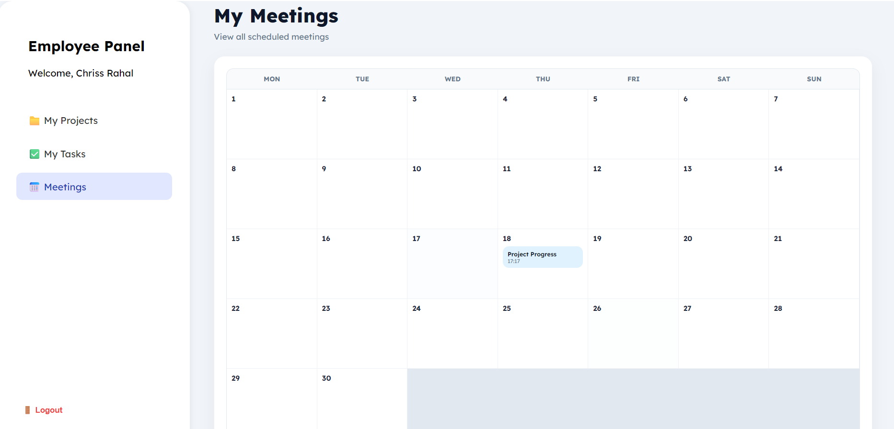

---

## 🔐 Authentication

  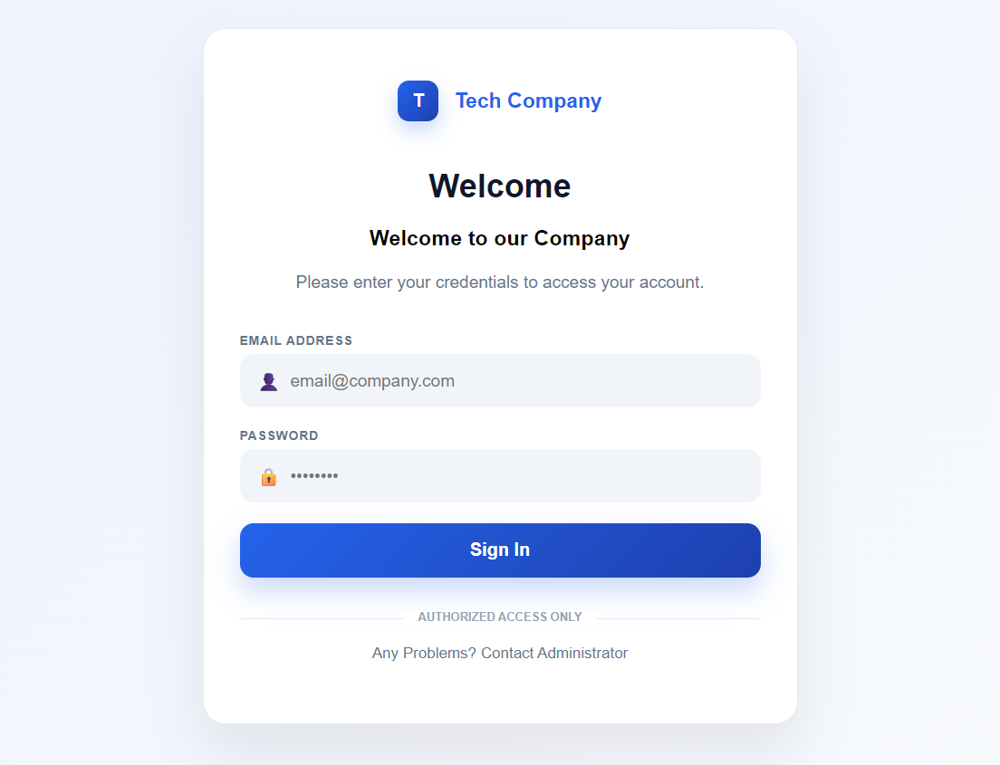

---

## 📌 Project Info

- Full-stack web application
- Frontend: React
- Backend: ASP.NET Core Web API
- Database: MySQL
- Role-based system (Admin / Manager / Employee)
- Developed as academic project by 2 students
